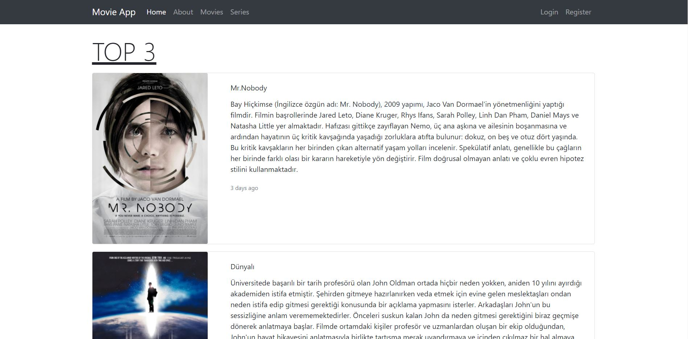
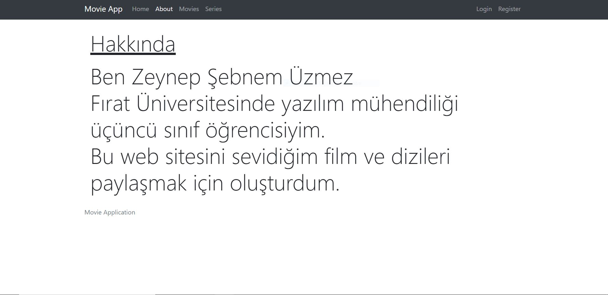
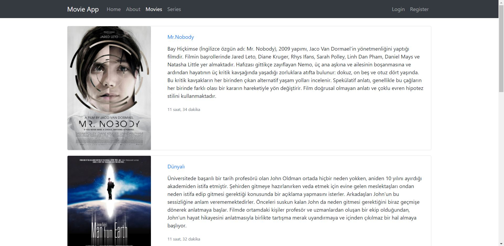
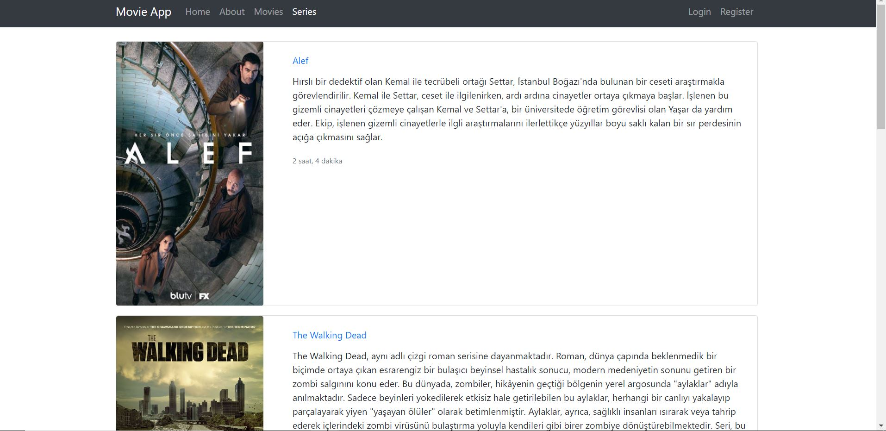
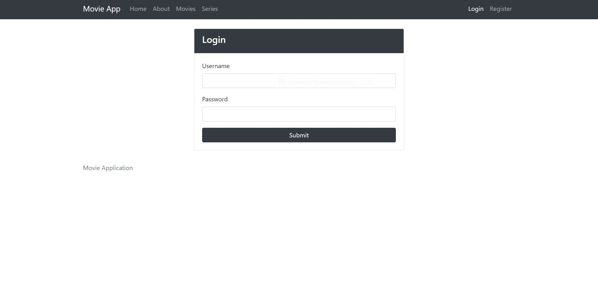
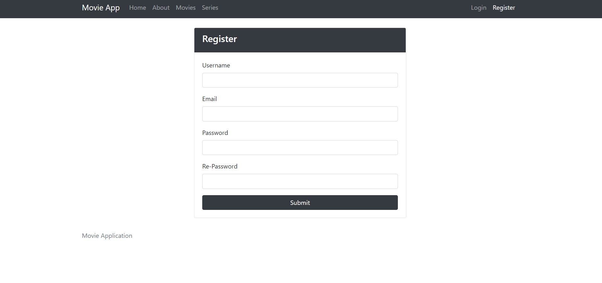

# MovieApp
<h2>Movie Websitesi </h2>
        
Bu websitesi sadece bootstrap cssleri ve django kullanarak oluşturduğum fullstack responsive bir websitesidir.
 
        
Site Görünüşü :

        
Home Sayfası
 
         
         
About Sayfası
 
          
         
Movies Sayfası
 
          
         
Series Sayfası
 
          
         
Login Sayfası
 
          
         
Register Sayfası
 
          
        
        
        
